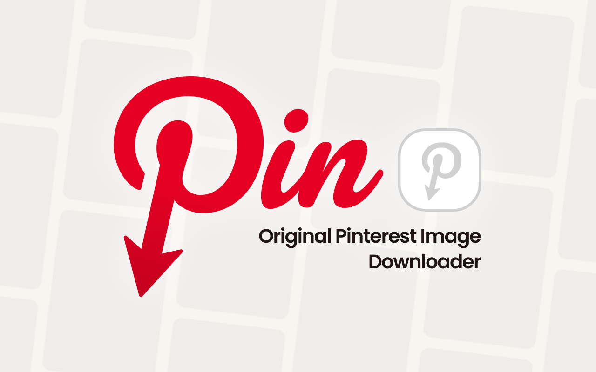
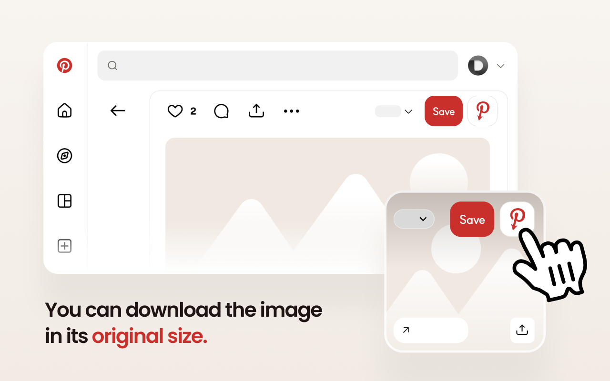
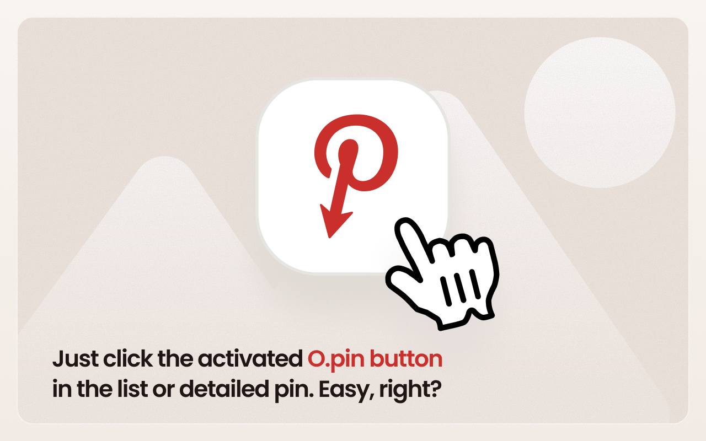
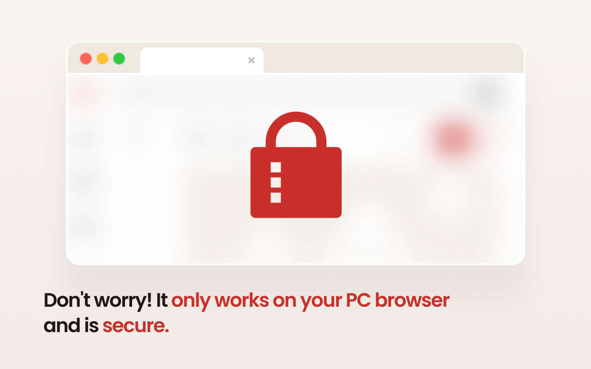

# Opin — View Original Pinterest Images

**English** · [한국어](docs/README.ko.md) · [日本語](docs/README.ja.md) · [简体中文](docs/README.zh-CN.md) · [繁體中文](docs/README.zh-TW.md) · [ไทย](docs/README.th.md) · [Italiano](docs/README.it.md) · [Русский](docs/README.ru.md)

Opin is a browser extension that lets you open the original, high‑resolution image behind any Pinterest pin. It adds a button next to Pinterest's **Save** button — click it to open the full‑size original in a new tab.

It's built for designers and researchers who benchmark on Pinterest and need the highest‑quality source images.

## Features

- Adds a **View original image** button next to the Save button — both in the grid (feed) and on the pin detail page.
- Opens the full‑resolution `/originals/` image in a new tab.
- Automatically checks whether an original exists and disables the button when it doesn't.
- Detects video pins (which have no original image) and marks them accordingly.
- Runs entirely in your browser — **no data collection, no external servers**.
- Multilingual UI: English, Korean, Japanese, Simplified Chinese, Traditional Chinese, Thai.

## Install

| Browser | Link |
| --- | --- |
| Chrome | https://chromewebstore.google.com/detail/babnlbndbmifokbppcefdfiblnfofojl |
| Edge | https://microsoftedge.microsoft.com/addons/detail/ooejcbgooenmekhfmbjfkdenajmkmoip |
| Whale | https://store.whale.naver.com/detail/gagclfkhikbhomlpdobdmdojkkdlaima |
| Firefox | https://addons.mozilla.org/ko/firefox/addon/opin-original-pinterest |

### Manual install (developer mode)

- **Chrome / Edge / Whale:** open `chrome://extensions`, enable **Developer mode**, click **Load unpacked**, and select the `chrome` folder.
- **Firefox:** open `about:debugging#/runtime/this-firefox`, click **Load Temporary Add‑on**, and select `firefox/manifest.json`.

## How to use

1. Open Pinterest.
2. Hover over a pin, or open its detail page.
3. Click the Opin button (red Pinterest **P** icon) next to **Save**.
4. The original‑resolution image opens in a new tab.

## Screenshots

## Privacy

Opin does not collect or store any personal data, and never communicates with external servers. See the full [Privacy Policy](PRIVACY.md).

## Contact

Questions and bug reports: [GitHub Issues](https://github.com/catgarret/Opin/issues) · official@dongri.me

## License

MIT © [dongri.me](https://dongri.me) · Built with AI vibe-coding.
