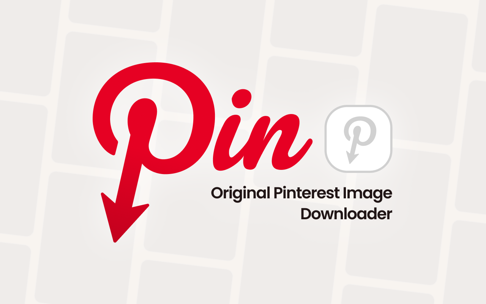
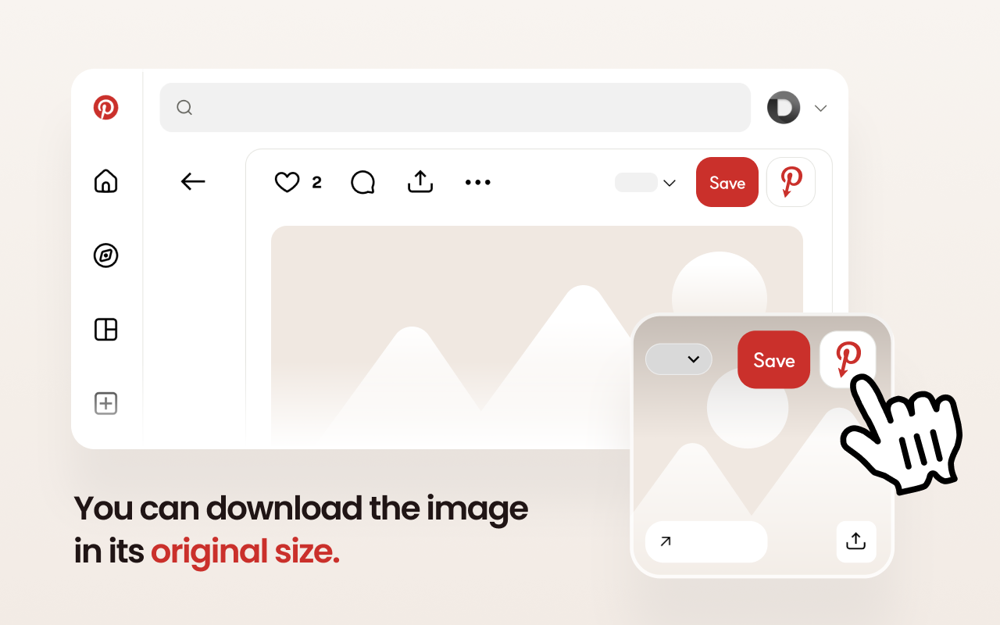
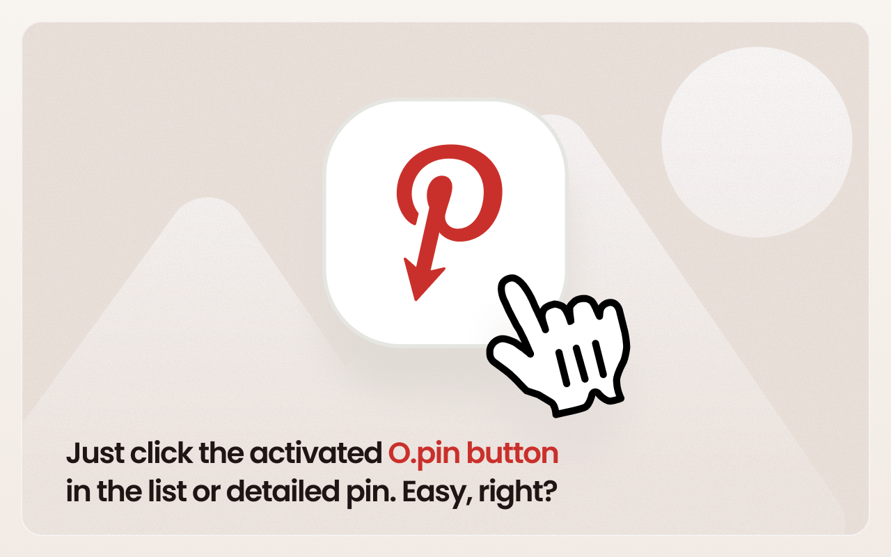
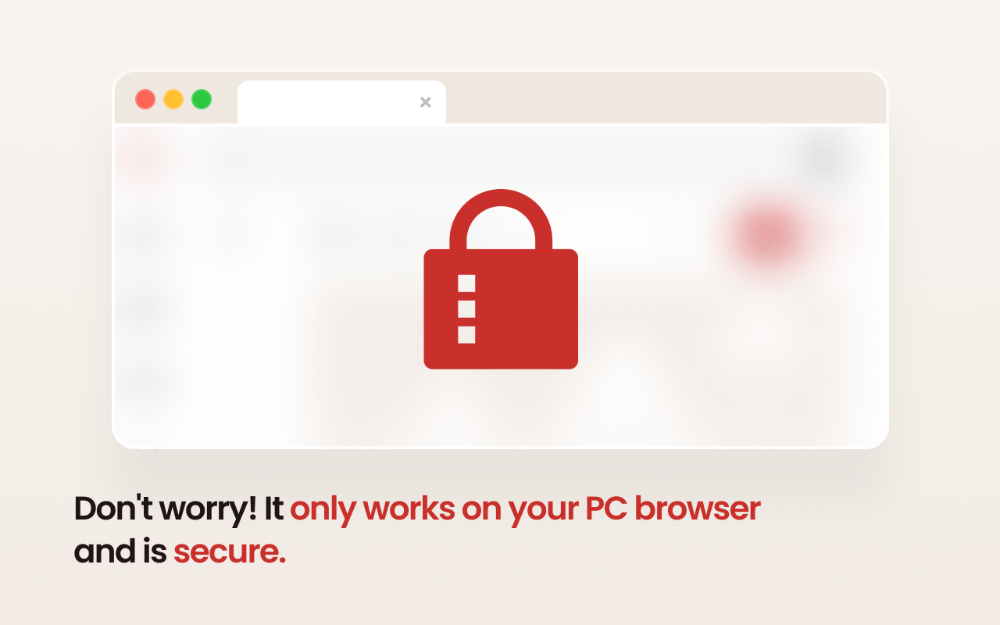

# Opin — Visualizza le immagini originali di Pinterest

[English](../README.md) · [한국어](README.ko.md) · [日本語](README.ja.md) · [简体中文](README.zh-CN.md) · [繁體中文](README.zh-TW.md) · [ไทย](README.th.md) · **Italiano** · [Русский](README.ru.md)

Opin è un'estensione del browser che ti permette di aprire l'immagine originale ad alta risoluzione dietro qualsiasi Pin di Pinterest. Aggiunge un pulsante accanto al pulsante **Salva** di Pinterest: cliccandolo, l'originale a dimensione piena si apre in una nuova scheda.

È pensata per designer e ricercatori che usano Pinterest come riferimento e hanno bisogno delle immagini sorgente della massima qualità.

## Informazioni su questo repository

Questo repository fornisce la documentazione del prodotto, i link agli store ufficiali, le informazioni di supporto e l'informativa sulla privacy di Opin.

Il codice sorgente dell'estensione non è distribuito pubblicamente. Installa Opin esclusivamente dagli store ufficiali di estensioni per browser elencati di seguito.

## Funzionalità

- Aggiunge un pulsante **Visualizza immagine originale** accanto al pulsante Salva — sia nella griglia (feed) sia nella pagina di dettaglio del Pin.
- Apre l'immagine `/originals/` a piena risoluzione in una nuova scheda.
- Verifica automaticamente se l'originale esiste e disabilita il pulsante quando non è disponibile.
- Rileva i Pin video (che non hanno un'immagine originale) e li contrassegna di conseguenza.
- Funziona interamente nel tuo browser — **nessuna raccolta di dati, nessun server esterno**.
- Interfaccia multilingue: inglese, coreano, giapponese, cinese semplificato, cinese tradizionale, thailandese.

## Installazione dagli store ufficiali

| Browser | Link |
| --- | --- |
| Chrome | https://chromewebstore.google.com/detail/babnlbndbmifokbppcefdfiblnfofojl |
| Edge | https://microsoftedge.microsoft.com/addons/detail/ooejcbgooenmekhfmbjfkdenajmkmoip |
| Whale | https://store.whale.naver.com/detail/gagclfkhikbhomlpdobdmdojkkdlaima |
| Firefox | https://addons.mozilla.org/addon/opin-original-pinterest/ |

## Come si usa

1. Apri Pinterest.
2. Passa il mouse su un Pin, oppure aprine la pagina di dettaglio.
3. Clicca il pulsante Opin (icona **P** rossa di Pinterest) accanto a **Salva**.
4. L'immagine a risoluzione originale si apre in una nuova scheda.

## Screenshot

## Privacy

Opin non raccoglie né memorizza alcun dato personale e non comunica mai con server esterni. Consulta l'[Informativa sulla privacy](PRIVACY.it.md) completa.

## Contatti

Domande e segnalazioni di bug: [GitHub Issues](https://github.com/catgarret/Opin/issues) · official@dongri.me

## Licenza

La [Licenza MIT](../LICENSE) si applica esclusivamente alla documentazione e agli altri file pubblicati in questo repository. Non si applica all'estensione per browser Opin né al relativo codice sorgente.

© [dongri.me](https://dongri.me) · Realizzato con AI vibe-coding.
