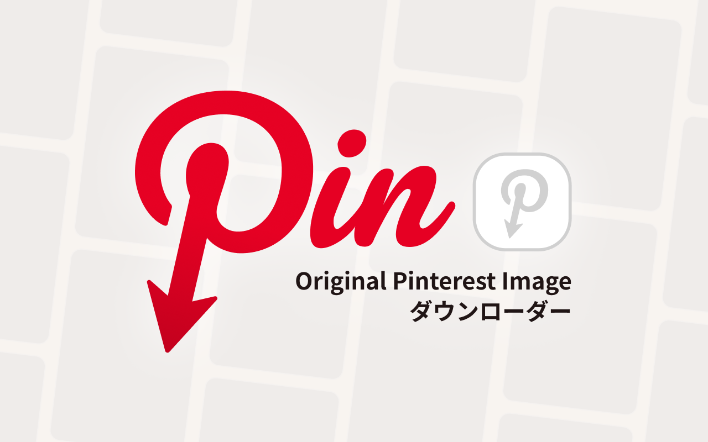
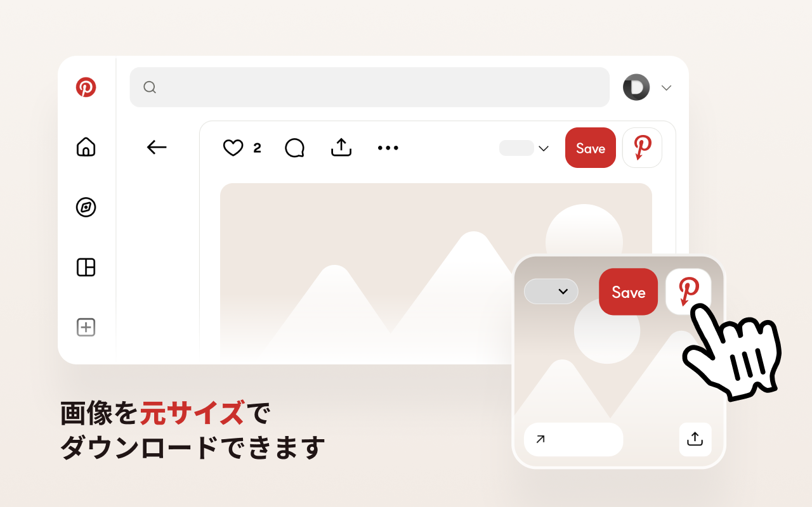
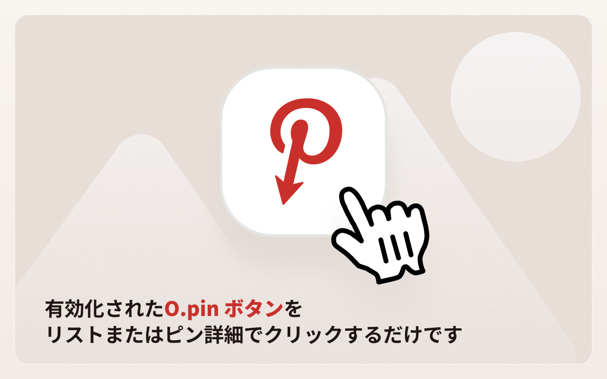
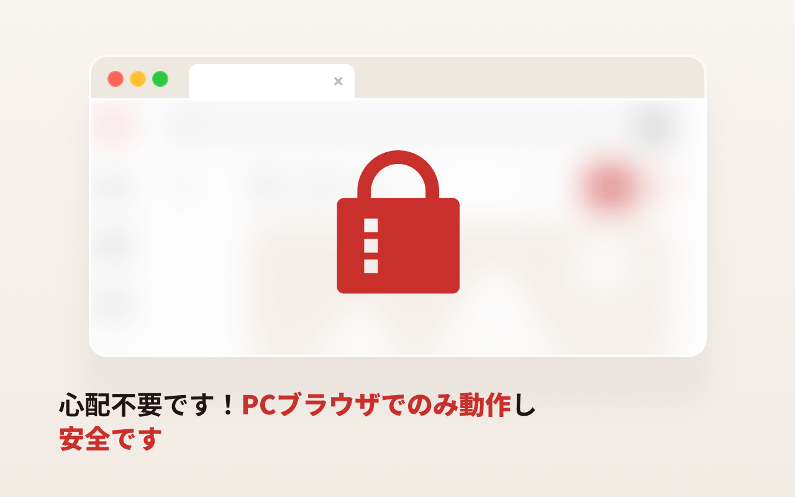

# Opin — Pinterest のオリジナル画像を表示

[English](../README.md) · [한국어](README.ko.md) · **日本語** · [简体中文](README.zh-CN.md) · [繁體中文](README.zh-TW.md) · [ไทย](README.th.md) · [Italiano](README.it.md) · [Русский](README.ru.md)

Opin は、Pinterest のピンの元となる高解像度のオリジナル画像を開けるブラウザ拡張機能です。Pinterest の**保存**ボタンの横にボタンを追加し、クリックするとオリジナル画像が新しいタブで開きます。

Pinterest でベンチマークを行い、最高品質のソース画像を必要とするデザイナーやリサーチャーのために作りました。

## 機能

- **保存**ボタンの横に**オリジナル画像を表示**ボタンを追加 — グリッド（フィード）とピン詳細ページの両方に対応。
- フル解像度の `/originals/` 画像を新しいタブで開く。
- オリジナルの有無を自動で確認し、存在しない場合はボタンを無効化。
- オリジナル画像を持たない動画ピンを検出して区別。
- すべての処理はブラウザ内でのみ動作 — **データ収集なし、外部サーバー通信なし**。
- 多言語 UI：英語、韓国語、日本語、簡体字中国語、繁体字中国語、タイ語。

## インストール

| ブラウザ | リンク |
| --- | --- |
| Chrome | https://chromewebstore.google.com/detail/babnlbndbmifokbppcefdfiblnfofojl |
| Edge | https://microsoftedge.microsoft.com/addons/detail/ooejcbgooenmekhfmbjfkdenajmkmoip |
| Whale | https://store.whale.naver.com/detail/gagclfkhikbhomlpdobdmdojkkdlaima |
| Firefox | 近日公開 |

### 手動インストール（開発者モード）

- **Chrome / Edge / Whale:** `chrome://extensions` を開き、**デベロッパーモード**を有効化 → **パッケージ化されていない拡張機能を読み込む** → `chrome` フォルダを選択。
- **Firefox:** `about:debugging#/runtime/this-firefox` を開き、**一時的なアドオンを読み込む** → `firefox/manifest.json` を選択。

## 使い方

1. Pinterest を開きます。
2. ピンにカーソルを合わせるか、詳細ページを開きます。
3. **保存**ボタンの横にある Opin ボタン（赤い Pinterest の **P** アイコン）をクリックします。
4. オリジナル解像度の画像が新しいタブで開きます。

## スクリーンショット

## プライバシー

Opin は個人情報を一切収集・保存せず、外部サーバーとも通信しません。詳しくは[プライバシーポリシー](PRIVACY.ja.md)をご覧ください。

## お問い合わせ

質問・不具合報告：[GitHub Issues](https://github.com/catgarret/Opin/issues) · official@dongri.me

## ライセンス

MIT © Dongkyu LEE
