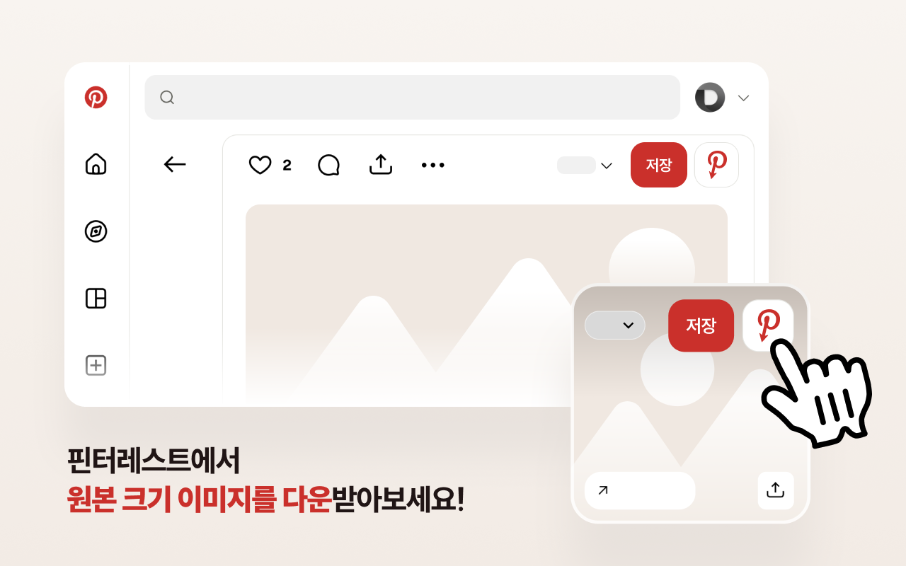
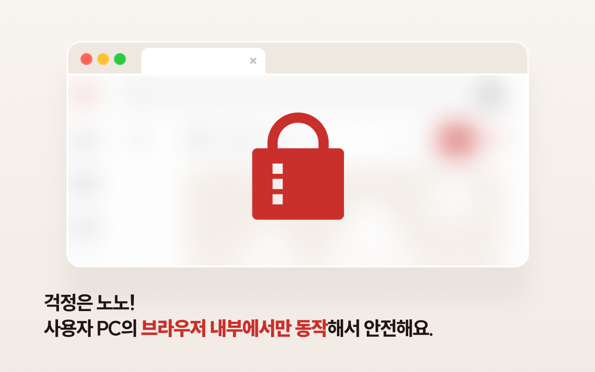

# Opin — Pinterest 원본 이미지 보기

[English](../README.md) · **한국어** · [日本語](README.ja.md) · [简体中文](README.zh-CN.md) · [繁體中文](README.zh-TW.md) · [ไทย](README.th.md) · [Italiano](README.it.md) · [Русский](README.ru.md)

Opin은 Pinterest 핀의 원본 고해상도 이미지를 바로 열 수 있게 해 주는 브라우저 확장 프로그램입니다. Pinterest의 **저장** 버튼 옆에 버튼을 추가하며, 클릭하면 원본 이미지가 새 탭으로 열립니다.

Pinterest에서 벤치마킹을 하며 최고 품질의 원본 이미지가 필요한 디자이너·리서처를 위해 만들었습니다.

## 기능

- **저장** 버튼 옆에 **원본 이미지 보기** 버튼 추가 — 그리드(피드)와 핀 상세 페이지 모두 지원.
- 원본 해상도 `/originals/` 이미지를 새 탭에서 열기.
- 원본 존재 여부를 자동으로 확인하고, 없으면 버튼을 비활성화.
- 원본이 없는 영상 핀을 감지해 별도로 표시.
- 모든 처리가 브라우저 안에서만 동작 — **데이터 수집 없음, 외부 서버 통신 없음**.
- 다국어 UI: 영어, 한국어, 일본어, 중국어 간체, 중국어 번체, 태국어.

## 설치

| 브라우저 | 링크 |
| --- | --- |
| Chrome | https://chromewebstore.google.com/detail/babnlbndbmifokbppcefdfiblnfofojl |
| Edge | https://microsoftedge.microsoft.com/addons/detail/ooejcbgooenmekhfmbjfkdenajmkmoip |
| Whale | https://store.whale.naver.com/detail/gagclfkhikbhomlpdobdmdojkkdlaima |
| Firefox | 준비 중 |

### 수동 설치 (개발자 모드)

- **Chrome / Edge / Whale:** `chrome://extensions` 접속 → **개발자 모드** 켜기 → **압축해제된 확장 프로그램을 로드합니다** → `chrome` 폴더 선택.
- **Firefox:** `about:debugging#/runtime/this-firefox` 접속 → **임시 부가 기능 로드** → `firefox/manifest.json` 선택.

## 사용 방법

1. Pinterest를 엽니다.
2. 핀에 마우스를 올리거나 상세 페이지를 엽니다.
3. **저장** 버튼 옆의 Opin 버튼(빨간 Pinterest **P** 아이콘)을 클릭합니다.
4. 원본 해상도 이미지가 새 탭에서 열립니다.

## 스크린샷

## 개인정보

Opin은 어떠한 개인정보도 수집·저장하지 않으며, 외부 서버와 통신하지 않습니다. 자세한 내용은 [개인정보처리방침](PRIVACY.ko.md)을 참고하세요.

## 문의

질문 및 버그 제보: [GitHub Issues](https://github.com/catgarret/Opin/issues) · official@dongri.me

## 라이선스

MIT © Dongkyu LEE
