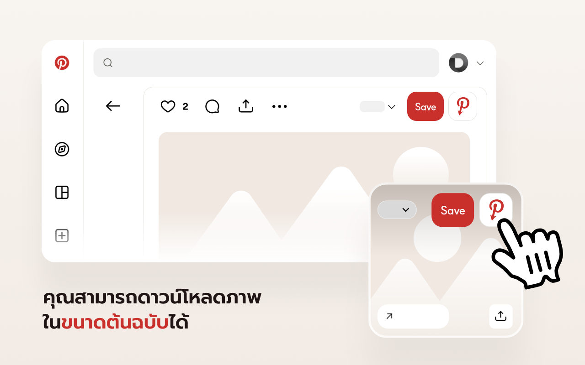
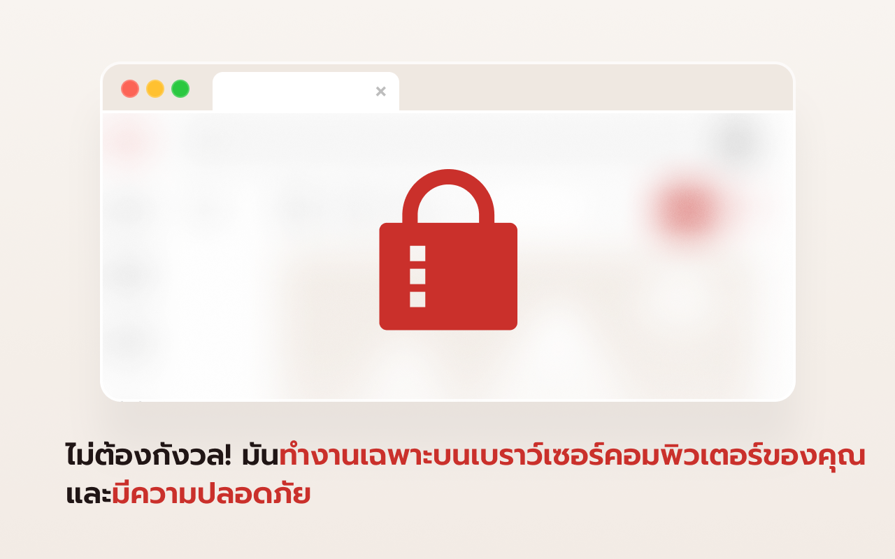

# Opin — ดูภาพต้นฉบับของ Pinterest

[English](../README.md) · [한국어](README.ko.md) · [日本語](README.ja.md) · [简体中文](README.zh-CN.md) · [繁體中文](README.zh-TW.md) · **ไทย** · [Italiano](README.it.md) · [Русский](README.ru.md)

Opin เป็นส่วนขยายของเบราว์เซอร์ที่ช่วยให้คุณเปิดภาพต้นฉบับความละเอียดสูงที่อยู่เบื้องหลังพินใด ๆ ของ Pinterest ได้ โดยจะเพิ่มปุ่มไว้ข้าง ๆ ปุ่ม **บันทึก (Save)** ของ Pinterest คลิกแล้วภาพต้นฉบับขนาดเต็มจะเปิดขึ้นในแท็บใหม่

ออกแบบมาเพื่อดีไซเนอร์และนักวิจัยที่ใช้ Pinterest หาแรงบันดาลใจและต้องการภาพต้นฉบับคุณภาพสูงสุด

## คุณสมบัติ

- เพิ่มปุ่ม **ดูภาพต้นฉบับ** ไว้ข้างปุ่มบันทึก — รองรับทั้งหน้ากริด (ฟีด) และหน้ารายละเอียดพิน
- เปิดภาพ `/originals/` ความละเอียดเต็มในแท็บใหม่
- ตรวจสอบอัตโนมัติว่ามีภาพต้นฉบับหรือไม่ และปิดใช้งานปุ่มเมื่อไม่มี
- ตรวจจับพินที่เป็นวิดีโอ (ซึ่งไม่มีภาพต้นฉบับ) และทำเครื่องหมายไว้
- ทำงานภายในเบราว์เซอร์ของคุณทั้งหมด — **ไม่เก็บข้อมูล ไม่มีการเชื่อมต่อเซิร์ฟเวอร์ภายนอก**
- อินเทอร์เฟซหลายภาษา: อังกฤษ เกาหลี ญี่ปุ่น จีนตัวย่อ จีนตัวเต็ม ไทย

## การติดตั้ง

| เบราว์เซอร์ | ลิงก์ |
| --- | --- |
| Chrome | https://chromewebstore.google.com/detail/babnlbndbmifokbppcefdfiblnfofojl |
| Edge | https://microsoftedge.microsoft.com/addons/detail/ooejcbgooenmekhfmbjfkdenajmkmoip |
| Whale | https://store.whale.naver.com/detail/gagclfkhikbhomlpdobdmdojkkdlaima |
| Firefox | เร็ว ๆ นี้ |

### ติดตั้งด้วยตนเอง (โหมดนักพัฒนา)

- **Chrome / Edge / Whale:** เปิด `chrome://extensions` เปิดใช้ **โหมดนักพัฒนา (Developer mode)** → **โหลดส่วนขยายที่ยังไม่บีบอัด (Load unpacked)** → เลือกโฟลเดอร์ `chrome`
- **Firefox:** เปิด `about:debugging#/runtime/this-firefox` → **โหลดส่วนเสริมชั่วคราว (Load Temporary Add-on)** → เลือก `firefox/manifest.json`

## วิธีใช้

1. เปิด Pinterest
2. เลื่อนเมาส์ไปที่พิน หรือเปิดหน้ารายละเอียดของพิน
3. คลิกปุ่ม Opin (ไอคอน **P** สีแดงของ Pinterest) ที่อยู่ข้างปุ่ม **บันทึก**
4. ภาพความละเอียดต้นฉบับจะเปิดขึ้นในแท็บใหม่

## ภาพหน้าจอ

## ความเป็นส่วนตัว

Opin ไม่เก็บหรือจัดเก็บข้อมูลส่วนบุคคลใด ๆ และไม่เชื่อมต่อกับเซิร์ฟเวอร์ภายนอก อ่านรายละเอียดได้ที่[นโยบายความเป็นส่วนตัว](PRIVACY.th.md)

## ติดต่อ

คำถามและการรายงานข้อบกพร่อง: [GitHub Issues](https://github.com/catgarret/Opin/issues) · official@dongri.me

## สัญญาอนุญาต

MIT © Dongkyu LEE
