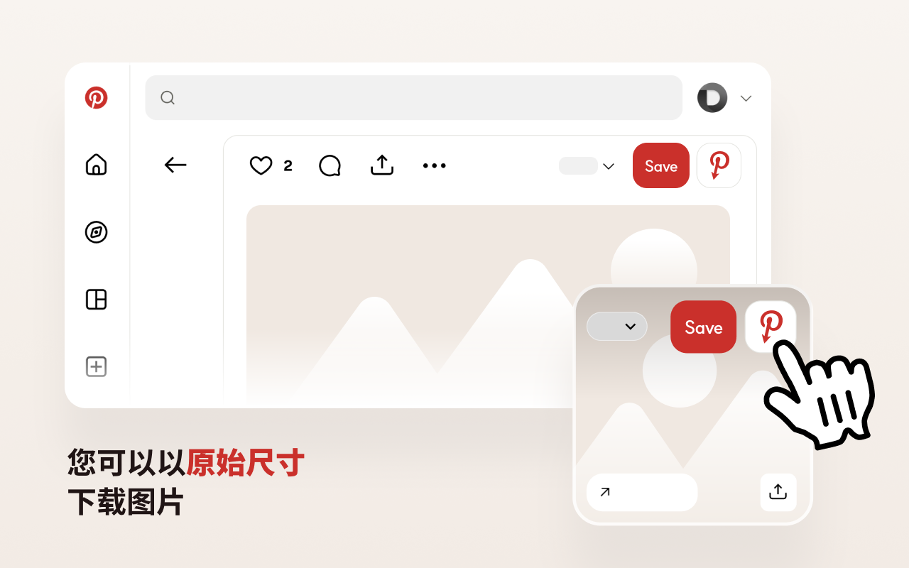

# Opin — 查看 Pinterest 原始图片

[English](../README.md) · [한국어](README.ko.md) · [日本語](README.ja.md) · **简体中文** · [繁體中文](README.zh-TW.md) · [ไทย](README.th.md) · [Italiano](README.it.md) · [Русский](README.ru.md)

Opin 是一款浏览器扩展，可让你打开任意 Pinterest 图钉背后的高分辨率原始图片。它会在 Pinterest 的**保存**按钮旁添加一个按钮，点击即可在新标签页中打开完整尺寸的原图。

它专为在 Pinterest 上做参考调研、需要最高质量素材图的设计师与研究者而打造。

## 功能

- 在**保存**按钮旁添加**查看原始图片**按钮 — 同时支持网格（信息流）和图钉详情页。
- 在新标签页中打开完整分辨率的 `/originals/` 原图。
- 自动检测原图是否存在，不存在时禁用按钮。
- 识别没有原图的视频图钉并单独标记。
- 全部处理仅在浏览器内进行 — **不收集数据，不与外部服务器通信**。
- 多语言界面：英语、韩语、日语、简体中文、繁体中文、泰语。

## 安装

| 浏览器 | 链接 |
| --- | --- |
| Chrome | https://chromewebstore.google.com/detail/babnlbndbmifokbppcefdfiblnfofojl |
| Edge | https://microsoftedge.microsoft.com/addons/detail/ooejcbgooenmekhfmbjfkdenajmkmoip |
| Whale | https://store.whale.naver.com/detail/gagclfkhikbhomlpdobdmdojkkdlaima |
| Firefox | 即将推出 |

### 手动安装（开发者模式）

- **Chrome / Edge / Whale：** 打开 `chrome://extensions`，启用**开发者模式** → **加载已解压的扩展程序** → 选择 `chrome` 文件夹。
- **Firefox：** 打开 `about:debugging#/runtime/this-firefox` → **临时载入附加组件** → 选择 `firefox/manifest.json`。

## 使用方法

1. 打开 Pinterest。
2. 将鼠标悬停在图钉上，或打开其详情页。
3. 点击**保存**按钮旁的 Opin 按钮（红色 Pinterest **P** 图标）。
4. 原始分辨率图片将在新标签页中打开。

## 截图

## 隐私

Opin 不收集或存储任何个人数据，也从不与外部服务器通信。详见[隐私政策](PRIVACY.zh-CN.md)。

## 联系

问题与错误反馈：[GitHub Issues](https://github.com/catgarret/Opin/issues) · official@dongri.me

## 许可证

MIT © Dongkyu LEE
