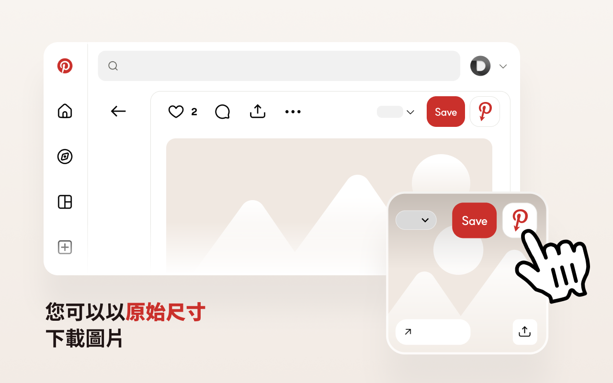
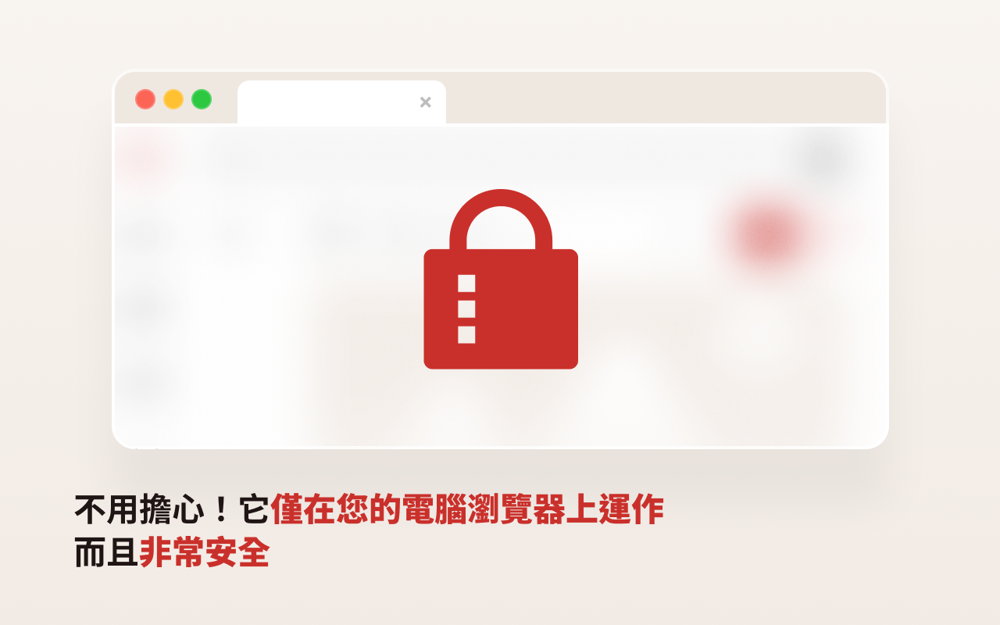

# Opin — 檢視 Pinterest 原始圖片

[English](../README.md) · [한국어](README.ko.md) · [日本語](README.ja.md) · [简体中文](README.zh-CN.md) · **繁體中文** · [ไทย](README.th.md) · [Italiano](README.it.md) · [Русский](README.ru.md)

Opin 是一款瀏覽器擴充功能，可讓你開啟任何 Pinterest 圖釘背後的高解析度原始圖片。它會在 Pinterest 的**儲存**按鈕旁新增一個按鈕，點擊即可在新分頁中開啟完整尺寸的原圖。

它專為在 Pinterest 上進行參考研究、需要最高品質素材圖的設計師與研究者而打造。

## 功能

- 在**儲存**按鈕旁新增**檢視原始圖片**按鈕 — 同時支援格線（動態消息）與圖釘詳細頁。
- 在新分頁中開啟完整解析度的 `/originals/` 原圖。
- 自動偵測原圖是否存在，不存在時停用按鈕。
- 辨識沒有原圖的影片圖釘並另行標記。
- 所有處理僅在瀏覽器內進行 — **不收集資料，不與外部伺服器通訊**。
- 多語言介面：英文、韓文、日文、簡體中文、繁體中文、泰文。

## 安裝

| 瀏覽器 | 連結 |
| --- | --- |
| Chrome | https://chromewebstore.google.com/detail/babnlbndbmifokbppcefdfiblnfofojl |
| Edge | https://microsoftedge.microsoft.com/addons/detail/ooejcbgooenmekhfmbjfkdenajmkmoip |
| Whale | https://store.whale.naver.com/detail/gagclfkhikbhomlpdobdmdojkkdlaima |
| Firefox | https://addons.mozilla.org/en-US/firefox/addon/opin-original-pinterest |

### 手動安裝（開發者模式）

- **Chrome / Edge / Whale：** 開啟 `chrome://extensions`，啟用**開發人員模式** → **載入未封裝項目** → 選擇 `chrome` 資料夾。
- **Firefox：** 開啟 `about:debugging#/runtime/this-firefox` → **載入暫時性附加元件** → 選擇 `firefox/manifest.json`。

## 使用方式

1. 開啟 Pinterest。
2. 將滑鼠移到圖釘上，或開啟其詳細頁。
3. 點擊**儲存**按鈕旁的 Opin 按鈕（紅色 Pinterest **P** 圖示）。
4. 原始解析度圖片將在新分頁中開啟。

## 螢幕截圖

## 隱私

Opin 不會收集或儲存任何個人資料，也從不與外部伺服器通訊。詳見[隱私權政策](PRIVACY.zh-TW.md)。

## 聯絡

問題與錯誤回報：[GitHub Issues](https://github.com/catgarret/Opin/issues) · official@dongri.me

## 授權

MIT © [dongri.me](https://dongri.me) · 以 AI 氛圍編程（vibe coding）打造。
